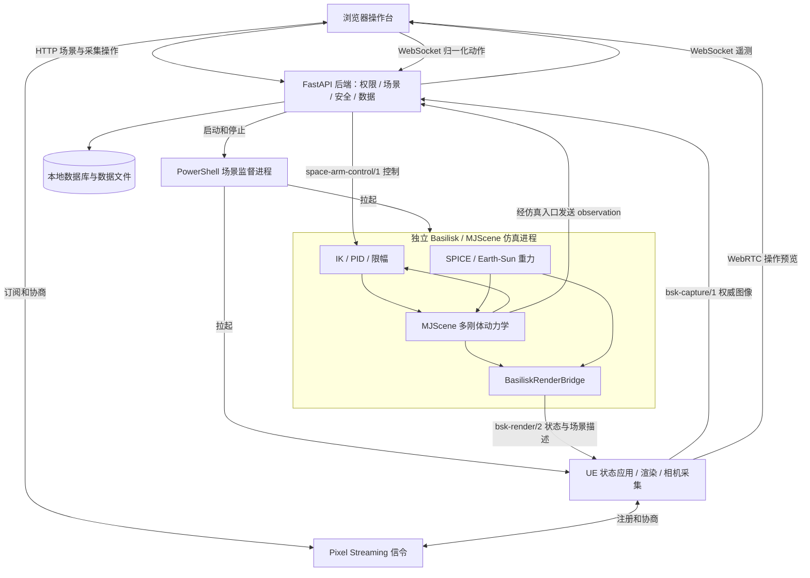
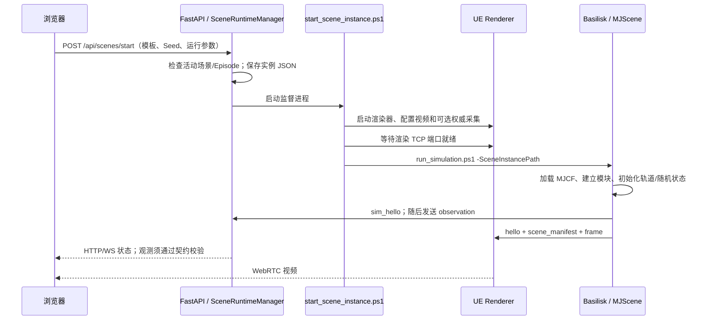

# 太空仿真平台总体架构设计与实现总结

> 文档日期：2026-09-08；待抓取目标更新：2026-09-09。性质：依据代码整理的当前架构说明，不是所有规划能力均已实现的承诺。
>
> 代码基线：服务端 `10bf803`；UE 适配器 `a1dd084`。本文、同次文档调整及后续反作用轮/观测修复及目标替换尚不包含在这两个提交中。
>
> **更新现状：SARM 8/6 项观测校验缺口已修复，三个真实转子和初始惯性姿态闭环已接入。** 真实 Hub/Recorder 与 UE 渲染协议完成隔离集成测试，但这不代表 GPU 视频与全部权威采集链路已验收。详见[姿态控制](ATTITUDE_CONTROL.md)与[当前缺口](#gaps)。

## 阅读导航

1. [系统定位与核心原则](#overview)
2. [仓库、文件与进程边界](#layout)
3. [系统总体结构](#topology)
4. [模块职责及源码索引](#modules)
5. [平台启动、场景生命周期与复现](#lifecycle)
6. [遥操作控制链路与安全机制](#control)
7. [BSK 与 MJScene 的真实执行关系](#dynamics)
8. [模型、器件与配置归属](#configuration)
9. [时间、坐标系、轨道与星历](#frames)
10. [通信协议与接口](#protocols)
11. [UE 渲染、相机与视频预览](#rendering)
12. [权威采集、Episode、任务与归档](#data)
13. [身份权限与部署信任边界](#security)
14. [部署、运行与故障定位](#operations)
15. [当前缺口与实现状态矩阵](#gaps)
16. [扩展设计与开发约定](#extensions)
17. [验证分层与验收标准](#verification)
18. [关键设计决策与文档维护](#decisions)

<a id="overview"></a>
## 1. 系统定位与核心原则

平台面向**太空机械臂遥操作、自由漂浮多刚体仿真、UE 可视化与同步训练数据采集**。当前默认场景是 SARM 卫星本体、三个正交反作用轮、六轴机械臂、双指夹爪及自由漂浮的地面验证星（被动外侧板铰链），不是旧的 CubeSat + SO-101 模型。

本文使用三种状态描述：

- **已接入**：能在默认 SARM 入口中找到实际构建、调用或消息连接。
- **已有基础能力**：代码、协议或测试中存在，但默认场景没有完成对应的设备建模或集成。
- **待实现/待修复**：仅为建议，或已确认存在不一致；不能列为现成功能。

核心原则：

1. **运动状态只由一套动力学推进。** BSK 承担调度、环境模型与控制；在当前 SARM 路径中，MJScene 是多刚体、关节、约束、接触及力耦合积分的唯一权威。
2. **UE 不模拟另一份卫星/机械臂动力学。** 它消费状态、创建 Actor、更新视觉效果及采集图像；自由相机移动不改变物理场景。
3. **人机输入不直接移动机械臂 Actor。** 机械臂指令通过后端安全处理后进入 BSK 控制链路。
4. **预览与训练采集分开。** WebRTC 预览允许插值、短时外推与丢帧；保存的权威图像必须能匹配到源仿真帧。
5. **天体渲染和动力学共享星历及仿真时钟。** 不能另设一个位置不一致的背景地球，也不能用墙钟独立旋转天体。
6. **模块存在不等于器件已配置。** 当前反作用轮已实际安装并受控，但仅有推进器/CSS 的状态字段或可视化适配不代表它们已成为物理器件。

当前不是自主抓取策略、视觉导航闭环、分布式并行场景调度器或硬实时平台；现有任务接口也不是自动训练系统。

<a id="layout"></a>
## 2. 仓库、文件与进程边界

### 2.1 两个仓库

本文定义：`SERVER_ROOT` 为包含服务端 `README.md`、`backend/`、`simulation/` 的 Git 根目录；`UE_REPO` 为 `-AdapterRoot` 指向的适配器 Git 根目录。以 `UE:` 开头的源码位置均相对 `UE_REPO`，不假定两个仓库的本机绝对路径相同。

```text
SERVER_ROOT/
├── backend/space_arm_platform/    API、权限、场景管理、控制/采集接入、数据管理
├── frontend/                     浏览器操作台，JavaScript + Vite + Pixel Streaming SDK
├── signalling/                   带访问令牌校验的 Pixel Streaming 信令实现
├── simulation/                   遥操作入口、运动学、通用架构接口
├── model/SARM/                   当前模型源文件、网格、原生场景脚本
├── model/任务盒_v1/                SolidWorks/STEP 设计源文件，非默认运行模型
├── contracts/                    JSON Schema 协议描述
├── scripts/                      PowerShell 启动、准备与停止脚本
├── tests/、tools/、docs/           测试、调试工具、文档
├── run/、logs/                    本机进程状态、实例配置、日志、验证证据（不提交）
└── data/                         用户数据库、Episode、任务、归档（不提交）

UE_REPO/
├── Adapters/bsk_render_adapter/   Python 状态桥、设备适配、协议、录制、模型元数据解析
└── Unreal/BskUnrealRenderer/
    ├── Plugins/BskUnrealRuntime/  UE 网络接收、状态应用、相机、采集和渲染扩展
    ├── Content/                  已导入网格、材质、地球/星空/太阳资源
    ├── Config/                   UE 项目与视觉配置
    ├── examples/                 原生场景加载辅助及独立示例
    ├── scripts/                  UE 构建、资产准备、启动、测试
    ├── tests/、docs/              适配器测试和详细协议说明
    └── Saved/                    本机缓存、资源映射、UE 日志（不提交）
```

服务端已用 Git LFS 跟踪模型 OBJ/STL 和 CAD 源文件；UE 仓库用 LFS 跟踪 `.uasset` 等资产。XML、Python 和配置文本正常入 Git。

本机曾将模型放在服务端 Git 仓库外。2026-09-08 迁移后，旧外层 `model` 是指向仓库内 `model/` 的 Windows junction；原 IDE 路径仍指向同一份文件。新克隆不需要这个联接。具体目录和排除规则见[模型说明](../model/README.md)。

### 2.2 常驻进程与线程

| 单元 | 运行边界 | 主要职责 |
| --- | --- | --- |
| 浏览器 | 用户机器的浏览器进程 | 页面、输入、WebSocket、视频解码和遥测显示 |
| FastAPI/Uvicorn | 服务端 Python 进程 | API、单场景管理、控制接入、观测转发、Episode 管理 |
| 后端辅助线程/任务 | 后端进程内 | asyncio 看门狗与控制连接、TCP 图像接收线程、归档线程池 |
| Pixel Streaming 信令 | Node.js 进程 | Streamer 注册、播放器订阅、WebRTC 会话协商；不是动力学服务 |
| 场景监督脚本 | 场景对应的 PowerShell 进程 | 拉起 UE、等待监听端口、拉起仿真、维护生命周期 |
| Basilisk/MJScene | `mujoco-dev` 中的独立 Python 进程 | 场景构建、物理推进、IK/PID、环境、状态发布 |
| 渲染桥 | 上述仿真进程内 | BSK 模块采样状态，后台网络线程发送，不是独立服务进程 |
| Unreal Renderer | 独立 UE 进程 | 网络线程解析数据，Game Thread 应用状态/采集，GPU 渲染与编码 |

当前后端维护**一个活动场景、一个权威仿真连接和一个活动 Episode**。多个登录用户/浏览器页面不等于多个独立仿真实例。不要直接增加 Uvicorn worker 数量来扩容：内存中的场景、连接与操作权没有跨进程协调。

<a id="topology"></a>
## 3. 系统总体结构



此图描述组件连接方式。**原生 SARM → 后端的观测校验目前存在第 15 节所列的不一致**；图中的连接不代表该链路已通过当前版本端到端验收。

信令负责协商；视频通常通过浏览器与 UE 建立的 WebRTC 媒体通道传输，必要时由 TURN 中继，不经 FastAPI 转码。权威图像则独立走 TCP 采集通道进入后端。

<a id="modules"></a>
## 4. 模块职责及源码索引

| 层/组件 | 入口或主要源码 | 职责与边界 |
| --- | --- | --- |
| 页面与输入 | [frontend/app.js](../frontend/app.js) | 登录、场景选择、输入采样、视频生命周期、控制页面切换、遥测 |
| API 组装 | [app.py](../backend/space_arm_platform/app.py)、[main.py](../backend/space_arm_platform/main.py) | 生命周期、路由、共享组件、HTTP/WS 权限检查 |
| 场景管理 | [scene_runtime.py](../backend/space_arm_platform/scene_runtime.py) | 模板、Seed、实例 JSON、监督进程及状态查询 |
| 输入安全 | [safety.py](../backend/space_arm_platform/safety.py) | 数值合法性、序列去重、速度缩放/限幅、超时中性动作 |
| 控制与观测连接 | [simulation_hub.py](../backend/space_arm_platform/simulation_hub.py) | 单一仿真 TCP 连接、动作发送、观测校验和广播 |
| 原生仿真入口 | [teleop_grasp_unreal.py](../simulation/teleop_grasp_unreal.py) | 实例加载、IK、星历/重力接入、初始轨道、桥接、观测发送 |
| 机械臂运动学 | [serial_chain_kinematics.py](../simulation/serial_chain_kinematics.py) | MJCF 串联链解析、正运动学、雅可比与阻尼最小二乘逆解 |
| 物理模型与原生构建 | [sarm_ground_target_self_collision.xml](../model/SARM/platform/sarm_ground_target_self_collision.xml)（粗盒内部接触默认；旧粗盒、高精度实验与小方块入口保留）、[scenario_sarm_grasp.py](../model/SARM/platform/scenarios/scenario_sarm_grasp.py) | 刚体、惯量、关节、接触、执行器、原生 PID/限幅与初态 |
| 通用架构基础 | [architecture.py](../simulation/architecture.py) | 状态/控制抽象、接口、模块注册器、通用编排器；接入程度见第 7 节 |
| 身份与会话 | [auth.py](../backend/space_arm_platform/auth.py) | 两种用户角色、密码摘要、SQLite 会话 |
| 图像接收与配对 | [capture_receiver.py](../backend/space_arm_platform/capture_receiver.py)、[recorder.py](../backend/space_arm_platform/recorder.py) | 产品解包、预览分流、权威帧配对和落盘 |
| 任务与后台工作 | [tasks.py](../backend/space_arm_platform/tasks.py)、[jobs.py](../backend/space_arm_platform/jobs.py) | 持久化任务状态、Episode 归档，不负责自动控制策略 |
| Python 渲染适配 | `UE:Adapters/bsk_render_adapter/bridge.py`、`mjcf_assets.py`、`protocol.py` | 读 BSK/MJScene 消息、生成 manifest、转换坐标、非阻塞发送 |
| UE 状态应用 | `UE:Unreal/BskUnrealRenderer/Plugins/BskUnrealRuntime/Source/BskUnrealRuntime/` | `BskTcpReceiver`、`BskFrameParser`、`BskRenderWorldSubsystem`、`BskSceneController` |

<a id="lifecycle"></a>
## 5. 平台启动、场景生命周期与复现

### 5.1 平台启动不等于场景启动

入口为 [run_platform.ps1](../scripts/run_platform.ps1)：

1. 检查 PowerShell 7、Python/Conda/npm、UE 路径和资产；默认优先使用仓库内 `model/SARM/platform`，保留旧布局回退。
2. 清理本平台记录的旧进程，检查端口；启动本地官方信令或远程访问模式信令。
3. 按需构建 UE 模块、准备网格和运行时材质。SARM 调用适配器 `prepare_mjcf_assets.ps1`，生成本机绝对路径资源映射。
4. 通过 [run_backend.ps1](../scripts/run_backend.ps1) 构建前端并启动后端；后端开始监听 API、控制与采集端口。
5. 记录 `run/platform.json`，可打开浏览器。此时未启动供用户操作的持久 UE 场景和 Basilisk 仿真。

资产准备可能短暂启动 UE 编辑器/命令程序，这与“前端创建场景后运行的 UE 渲染实例”不同。

### 5.2 场景创建与执行



[SceneRuntimeManager](../backend/space_arm_platform/scene_runtime.py) 负责保存实例；[start_scene_instance.ps1](../scripts/start_scene_instance.ps1) 负责创建、监视子进程。主要状态为：

```text
idle → launching → starting_renderer → starting_simulation → running
                                             └────────────→ failed
running → stopped / completed / failed
```

重要边界：`running` 在监督脚本拉起仿真子进程后写入，**不是已收到合法观测、视频已解码或采集已匹配的健康证明**。诊断时要分别查看场景阶段、`simulation.connected`、观测增长和视频解码状态。

停止场景时，后端按需发送中性动作、将活动 Episode 标记为中止并提交归档，然后调用 [stop_scene_instance.ps1](../scripts/stop_scene_instance.ps1)。停止脚本按记录的 PID/启动时间检查并清理进程树，另有 UE PID 文件回退清理；并非任意按进程名杀掉所有 UE/Python。

### 5.3 实例配置和复现能力

当前默认模板为 `sarm-ground-validation-self-collision-grasp`（粗碰撞体·内部碰撞），以显式 geom pair 开启外侧板与固定目标接触，使用近似铰链间隙；不使用高精度三角面或新增角度限位。旧无内部接触粗盒、高精度实验、小方块模板保留，已有实例不自动迁移；随机化方案为 `none` 和 `training-v1`。实例采用 `space-arm-scene-instance/1`，保存到 `run/scenes/<instance-id>.json`。细节见[粗碰撞内部接触](COARSE_SELF_COLLISION.md)，实例包含：

- `created_by`、模板、实际 Seed，以及独立的轨道起点随机开关 `randomize_orbit_phase`（默认 `false`）；
- `environment`：星历历元、中心、参考系和轨道参数；
- `runtime`：仿真倍速、IK 频率、采集频率、是否启用权威采集；
- `randomization`：目标位姿/速度、8 个机械臂/夹爪初始关节值；新目标另外保存被动铰链的零位初态。
- `capture_target`：源/运行 XML、碰撞模式 `collision_model`、实验限制 `runtime_warning`、被动关节及估算质量；模型组合、真实性边界与 UE 资源见[待抓取目标](GROUND_CAPTURE_TARGET.md)。

局部抓取随机化使用 `random.Random(seed)`。轨道起点开关独立于 `none` / `training-v1`：开启时用独立的版本化随机流 `random.Random(f"space-arm-orbit-phase-v1:{seed}")` 均匀抽取 `[0, 360)` 度，只覆盖实例的 `environment.orbit.true_anomaly_deg`，不改变已有局部随机参数、轨道高度、倾角或星历时刻；关闭时仍为 180°。加载实例只应用保存的角度，不再次抽样。位置和速度由同一组轨道根数计算，再赋给权威 MJScene；渲染桥读取同一状态。详情见[轨道起点初始化](ORBIT_INITIALIZATION.md)。

目标初始角速度目前固定为零；即使旧实例包含非零值，仿真入口也会归零，以规避已验证的启动数值不稳定。

相同 Seed 可重建随机参数，**不等于保证跨 UE/GPU/引擎版本逐像素一致或跨物理版本逐位一致**。当前实例没有完整封存模型、软件环境及两仓库提交哈希；严格复现实验还需额外保存这些版本信息。

<a id="control"></a>
## 6. 遥操作控制链路与安全机制

### 6.1 数据流

```text
键盘 / 浏览器 Gamepad
  → 归一化末端线速度(3) + 角速度(3) + 夹爪开合(1)
  → /ws/operator：operator_action
  → 操作页面与场景所有权检查
  → SafetyController：序列、有限数值、速度缩放和限幅
  → AppliedAction：spacecraft_body 坐标系下的 SI 指令
  → SimulationHub 的 TCP 控制连接
  → SimulationControlClient 的最新指令缓存
  → 独立 IK task 更新目标关节状态
  → 原生 PID → 限幅器 → MJScene actuator
  → 物理状态反馈、渲染状态发布和后端 observation
```

浏览器动作约每 33 ms 发送一次；不是直接指定真实关节角。`action_ack.delivered_to_simulation` 只表示该次发送是否成功，不表示机械臂已经完成动作。仿真观测中的 `applied_action_sequence` 才反映目标缓存采用了哪个指令版本。

### 6.2 当前限制与失联行为

| 项目 | 代码中的默认值或行为 |
| --- | --- |
| 末端线速度档位 | 默认 `0.05 m/s`，可选范围 `0.01–0.20 m/s` |
| 末端角速度上限 | `0.50 rad/s` |
| 单指开合速度上限 | `0.01 m/s`；两指以同一标量命令分别沿各自关节轴运动 |
| 机械臂关节速度上限 | `[0.70, 0.70, 0.70, 0.90, 1.00, 1.00] rad/s` |
| 夹爪位置范围 | 每指 `0–0.0375 m` |
| 后端输入超时 | 阈值 `0.25 s`，看门狗约每 `0.05 s` 检查 |
| 仿真侧输入超时 | 独立按 `time.monotonic()` 判断 `0.25 s`，不依赖浏览器自觉归零 |
| 无输入/deadman 关闭 | 不再推进关节目标，目标速度归零，PID 继续保持；不是冻结轨道或强制清零物理速度 |

当前 `CartesianTeleopTarget` 用目标关节状态进行速度逆解并积分目标，真实关节由 PID 跟踪；它不是直接覆盖真实 `qpos`。IK 增量时间被裁剪到 `0–0.02 s`，因此降低 IK 频率不能未经验证就视为完全等价的控制行为。

页面失焦、隐藏、退出操作模式和操作页面切换会发送中性动作。当前急停按钮的“锁存”属于前端 `state.estopped`，后端协议没有独立持久化的全局急停锁；不能把它描述为已经实现的跨页面、跨会话硬件急停系统。

所有这些均为仿真软件安全机制，不构成真实硬件安全认证。

<a id="dynamics"></a>
## 7. BSK 与 MJScene 的真实执行关系

### 7.1 当前实际入口

[run_simulation.ps1](../scripts/run_simulation.ps1) 在 `mujoco-dev` 环境启动 `simulation/teleop_grasp_unreal.py`。该入口通过 `UE:Unreal/BskUnrealRenderer/examples/scenario_spacecraft_arm_grasp_unreal.py` 的加载器，读取模型目录中的 `scenarios/scenario_sarm_grasp.py`。

原生脚本创建 `SimulationBaseClass.SimBaseClass`、`graspProcess`、`graspTask` 和 `MJScene.fromFile(...)`，然后建立 8 组关节 PID/限幅/执行器消息连接。服务端入口再接入遥操作 IK、SPICE、重力和渲染桥，并将原生轨迹发布器的参考函数替换为遥操作缓存。退出时恢复原引用、关闭网络并卸载星历内核。

**没有为卫星本体再并行建立一个独立 `spacecraft` 刚体积分循环。** 环境力与关节/接触动力学共同进入 MJScene 路径。

### 7.2 调度顺序

原生 `TIME_STEP=0.002 s`，即名义 500 Hz；积分内部可能多次调用动力学子任务。重要的子任务优先级如下，数值越大越早执行：

| MJScene 动力学子任务 | 优先级 | 原因 |
| --- | --- | --- |
| SPICE 星历 | `20000` | 先更新本次仿真时刻的天体状态 |
| MJScene 正向运动学 | `10000` | 发布当前子步刚体状态 |
| `NBodyGravity` | `9500` | 读取当前状态与质量属性计算环境作用 |
| 目标轨迹发布器 | `9000` | 将缓存的位置/速度参考写入 BSK 消息 |
| 各关节 PID | `8000 - i` | 消费参考和实测关节消息 |
| 各关节限幅器 | `7000 - i` | 限制输出，再写入对应 actuator |
| 反作用轮安全驱动 | `6500 - i` | 限矩、读取当前轮速并禁止超限方向加速；写入轮电机 |

另外：

- `sarmAttitudeTask` 默认 100 Hz，以 process 内 task 优先级 `-10` 加入；动力学之后运行导航/参考/误差/PD/轮矩分配，下次动力学消费保持后的指令。参考与组装惯量在初次有效状态锁存。
- `teleopIkTask` 默认 100 Hz，以 process 内 task 优先级 `100` 加入；避免在每个积分子步重复求解 IK。
- 渲染桥注册到外层 `graspTask`，优先级 `-10000`，自身按名义 30 Hz 节流采样。
- 这些优先级属于不同层级，不能将 process/task 的 `100` 与动力学子任务的 `9500` 当作同一张队列比较。
- XML 声明了 `timestep` 和 MuJoCo `integrator` 选项，但运行时仍由 Basilisk/MJScene 封装调度；不能据此假设另有一个独立 Python `mujoco.mj_step` 循环。

### 7.3 架构抽象与已接入部分

[architecture.py](../simulation/architecture.py) 定义了 `SceneState`、`EnvironmentState`、`ControlOutput`、`SceneBackend`、`EphemerisProvider`、`SimulationOrchestrator` 和 `BasiliskModuleRegistry`。

当前接入事实：

- `BasiliskModuleRegistry` 已在 SARM 路径中用于 `teleop_ik`、`render_state_publisher`。
- 姿态控制由原生 `AttitudeControl` 直接安装到 process/task；未迁入 registry。
- SPICE、重力、原生 PID 等通过 `scene.AddModelToDynamicsTask(...)` 直接接入，不是统一由 registry 挂载。
- `SimulationOrchestrator` 有通用接口和测试，但 **SARM 入口没有实例化它**；实际推进仍是 `ConfigureStopTime()` / `ExecuteSimulation()`。
- `space-sim-state/1` 是通用状态抽象的序列化契约，不是当前浏览器或 UE 正在接收的网络协议。

通用设计可作为后续扩展约定，但不能将这套抽象图当作已经替换了所有原生消息连接的实现。

<a id="configuration"></a>
## 8. 模型、器件与配置归属

### 8.1 当前配置位置

| 内容 | 当前来源 | 消费方 |
| --- | --- | --- |
| 刚体质量、质心、惯性张量、关节轴/范围、阻尼/摩擦、碰撞、执行器 | SARM 源参数在 `model/SARM/platform/sarm_platform.xml`；目标估算质量/惯量在 `tools/build_sarm_ground_target.py`；当前默认为 `sarm_ground_target_self_collision.xml`，含原外部粗盒及两个内部接触代理，参数同样由该生成器维护；`tools/build_satellite_mesh_collision.py` 派生的 `mesh_collision_trial/sarm_mesh_collision.xml` 仅保留供手动试验 | MJScene；部分元数据也被运动学/渲染适配器读取 |
| 太阳照明倍率（默认 1，范围 0～20,000） | 创建请求 → 场景实例 `environment.lighting.sunlight_intensity_scale` | 仅渲染 SceneSettings/UE，不参与动力学；见[配置说明](SUNLIGHT_CONFIGURATION.md) |
| 姿态开关、频率、PD 增益、轮速保护裕量 | `model/SARM/platform/attitude_control.json` | BSK 姿态模块；轮的物理参数仍从 MJCF 读取 |
| 相机挂载位姿、垂直 FOV、原始分辨率 | 同一 MJCF 的 `<camera>` | 适配器 manifest → UE 相机 |
| 原生步长、PID 增益、实际输出限幅、基准初态 | `scenario_sarm_grasp.py` 的 `TIME_STEP`、`KP`、`KD`、`TORQUE_LIMITS` 等 | BSK 原生控制和场景初始化 |
| 末端命令上限与输入超时 | `safety.py`；仿真侧另有超时检查 | 后端及仿真控制缓存 |
| IK 关节范围/速度限制 | `teleop_grasp_unreal.py` 中的数组 | 目标状态生成 |
| 随机状态、星历历元/中心、轨道、运行倍速和采集选项 | 场景实例 JSON；模板默认值在 `scene_runtime.py` | 启动脚本和仿真入口 |
| 后端端口、目录、用户初始化参数 | PowerShell 参数、环境变量、`PlatformConfig` | 后端与监督脚本 |
| 视觉材质、显示标定、太阳代理及背景配置 | `UE:Unreal/BskUnrealRenderer/Config/bsk_unreal_scene.json` 和 Content 资产 | UE，不决定真实卫星质量或轨道 |
| 网格源路径 → UE 资产路径 | `UE:Unreal/BskUnrealRenderer/Saved/AssetImport/sarm_platform.catalog.json` | 渲染适配器；本机生成，不提交 |

当前仍有重复配置，尚无统一配置中心。例如关节范围既在 XML 也在 Python 安全数组中；模型基准初态在原生脚本和实例生成器中均有定义。修改时必须检查所有消费者和回归测试。

XML 的执行器限制与 BSK 更严格的运行限制是两层约束：机械臂 XML 电机范围为 `±100`，原生 BSK 限幅为 `[1.5, 1.5, 1.5, 1.0, 1.0, 0.35] N·m`；两指 XML 范围 `±0.5`，BSK 每指上限 `0.05 N`。**只修改 XML 中的较大上限不会自动提高实际输出。**

太阳光照倍率在场景创建时设置并保存，运行中锁定。默认值保留原效果；0 关闭太阳直射而不关闭环境补光、自发光和曝光。它与 UE 本地标定相乘，保留星历方向、距离衰减和地影，见[太阳光照初始化](SUNLIGHT_CONFIGURATION.md)。

### 8.2 已接入反作用轮与后续器件归属

平台 XML 新增 `rw_x/y/z` 三个理想平衡转子、独立 hinge 和 motor。单轮暂定质量 1 kg、旋转惯量 0.01 kg·m²、限矩 ±0.2 N·m、轮速边界 6000 rpm。剩余本体质量/质心/惯量已扣除轮体分配，恢复原本体 162.76 kg 的锁定总预算，不能重复计入。

BSK 链为真值导航 + `inertial3D → attTrackingError → mrpFeedback → rwMotorTorque`，轮速数组与单电机指令由标准适配模块转换。默认保持初始 J2000 惯性姿态，非对地定向。轮体与本体的反作用完全由 MJScene 关节力学产生，没有第二个积分 hub 或额外本体反力矩。

物理参数归 XML，姿态控制增益/频率归 `attitude_control.json`，算法与消息连接归 `simulation/attitude_control.py`；详细参数、调度、初始组装惯量、饱和及验证见[姿态控制专题](ATTITUDE_CONTROL.md)。本次是无传感器噪声、无积分的理想轮闭环；暂未实现功耗、轮故障、推进器卸载或任意任务稳定性保证。

推进器和 CSS 仍只有适配基础能力，默认模型未安装。新增推进器时仍须明确作用点/方向、推力/比冲、质量流率、脉冲及动力学耦合边界，不可直接套用另一份独立 `spacecraft` 状态效应器而重复积分。

<a id="frames"></a>
## 9. 时间、坐标系、轨道与星历

### 9.1 多种频率和两种时间

| 环节 | 默认名义频率/周期 | 时基及说明 |
| --- | --- | --- |
| 浏览器动作发送 | 约 30 Hz（33 ms） | 墙钟，不是物理步长 |
| 后端输入看门狗 | 20 Hz（50 ms） | 墙钟/单调时钟 |
| IK task | 100 Hz | 仿真时间，启动/实例可配置 |
| 原生动力学 task | 500 Hz（2 ms） | 仿真时间；积分子步可能额外调用模块 |
| 渲染桥状态及 observation | 名义 30 Hz | 仿真时间；发布受原生 task 离散时刻约束 |
| UE 主视口预览 | 默认最高 60 FPS | 渲染/编码墙钟；不等于收到 60 Hz 的物理状态 |
| 两台独立相机视频 | 当前监督脚本最高 30 FPS | 默认 640×360；不是动力学采样率 |
| 权威采集 | 默认 10 Hz，默认不开启 | 根据源帧仿真时间采样，实际吞吐受 GPU/网络/磁盘影响 |

仿真入口通过 `time.monotonic()` 对照 `sim_seconds / simulation_rate` 尝试节拍控制；计算不足时会变慢，不保证硬实时。增大倍速不意味着把物理步长同时增大。

`sim_time_ns` 是仿真内时间；`wall_time_ns`、文件创建时间是机器时间。帧号、序列号和纳秒计数在线上使用十进制字符串，避免 JavaScript/JSON 双精度整数精度问题。

### 9.2 坐标契约

- **N：惯性参考系**。当前限定地心 `Earth`、平动参考系 `J2000`。
- **B：物体本体系**。操作命令固定为卫星 `spacecraft_body`；相机、geom 和 site 安装位姿相对其 body。
- **L：局部渲染坐标系**。当前原点跟随 `teleop/cubesat_bus`，适配器输出米制右手系局部坐标。
- **UE：显示坐标系**。转换器按默认 `100 cm/m` 缩放，并对局部 Y 轴镜像；不能将米、厘米或左右手系混用。

一般位置变换为：

```text
r_L = C_LN · (r_N - origin_N)
```

帧保留 `origin_N_m`。物体状态姿态为主动 body-to-local 四元数 `(w,x,y,z)`；对象即使有语义 parent，状态变换仍是世界/局部渲染帧中的绝对变换。只有安装用的 geom、相机等采用 body-local 变换。

**速度有特别约定**：桥接帧中的 `velocity_mps` 是惯性速度投影到局部轴，不是已减掉移动原点速度的位置导数。UE 不能用它直接外推局部位置，否则会把约 7.6 km/s 的轨道速度重复加入。当前 `ExtrapolateFrame()` 用连续局部位置差分进行外推，原点另行更新；姿态用旋转差分。详见[相机与频闪专题](SARM_CAMERAS_AND_FLICKER.md)。

当前 `joint_position_rad` 等遗留字段实际承载 8 个值：前 6 项为 rad，后 2 项为 m；速度同理。为兼容旧客户端保留此别名；新增明确的 `arm_joint_*`（6 项 rad/rad/s）和 `gripper_*`（2 项 m/m/s），后端校验二者与旧别名一致。不能把所有项都转成角度。通用状态 Schema 的关节字段也需同步考虑移动关节。

### 9.3 默认轨道、天体与照明

场景默认环境为：

| 参数 | 默认值 |
| --- | --- |
| 星历起点 | `2026-09-02 00:00:00 UTC`，不是当前系统日期 |
| 星历中心 / 平动参考系 | `Earth` / `J2000` |
| 固连姿态参考 | `IAU_EARTH`、`IAU_SUN` |
| 初始圆轨道高度 | `500000 m`（500 km） |
| 偏心率 / 倾角 | `0` / `51.6°` |
| RAAN / 近地点幅角 / 初始真近点角 | `0°` / `0°` / `180°` |
| 重力源 | 地球、太阳；当前采用点质量引力模型 |

代码把 `altitude_m` 用于 `a = R_E + altitude_m`；因此偏心率非零时它表示半长轴相对参考半径的增量，不是轨道上每一时刻的高度。实时高度应由地心距离减参考半径计算。当前加载器还检查近地点高度至少 120 km。

卫星和目标都加上同一惯性轨道速度，再叠加各自局部初始速度，避免将目标错误设置为近零绝对轨道速度。自由关节显式清零机械臂默认阻尼/摩擦，防止对轨道速度产生人为阻力。

SPICE 的同一组 Earth/Sun 状态同时用于引力与渲染。地球不是 XML 中的巨大碰撞球；UE 根据天体 manifest/帧创建地球，其姿态随仿真时间自转。由于采用地心参考系，公转表现为太阳相对地球的位置变化，而非地球绕固定太阳做独立动画。

默认未启用月球、其他行星、J2、气阻、太阳辐射压力或推进器力模型。装饰地球当前关闭。太阳使用近景视觉代理；照明方向、距离变化与地影几何来自真实星历，局部物体与天体表面分开照明。该实现不是绝对辐射标定、ITRF/EOP 高精度地理配准或完整传感器成像模型，详见[星历与显示对齐](CELESTIAL_ALIGNMENT.md)。

<a id="protocols"></a>
## 10. 通信协议与接口

### 10.1 默认端口及协议

| 通道 | 默认监听端/端口 | 发起方 → 接收方 | 格式及用途 |
| --- | --- | --- | --- |
| HTTP / WS | 后端 `8000` | 浏览器 → 后端 | API、静态页面、`/ws/operator` |
| 控制与观测 | 后端 `8766` | 仿真主动连接后端，双向收发 | `space-arm-control/1`；4 字节大端长度 + UTF-8 JSON；上限 8 MiB |
| 渲染状态 | UE `5558` | Python 渲染桥 → UE | `bsk-render/2`；4 字节大端长度 + JSON；上限 32 MiB |
| 图像采集 | 后端 `8767` | UE → 后端 | `bsk-capture/1`；外层长度 + JSON 长度 + JSON + 二进制产品区；上限 512 MiB |
| Streamer 信令 | Node `8888` | UE → 信令服务 | WebSocket 注册与 WebRTC 协商 |
| Player 信令 | Node `8080` | 浏览器 → 信令服务 | WebSocket 订阅与 WebRTC 协商 |
| 视频媒体 | WebRTC 协商得到 | UE ↔ 浏览器/必要时 TURN | 不固定等同于上述 TCP 信令端口 |

上述大小是接收器的包长限制，不是建议的正常包大小。端口可由启动参数覆盖；修改时要同时贯通启动器、后端、仿真和 UE 参数。

### 10.2 协议语义

- `space-arm-control/1`：仿真先发 `sim_hello`，后端发 `action`，仿真发 `observation`。后端只持有一个权威连接，新连接会替换旧连接。Schema 和 Pydantic 现有不一致见第 15 节。
- `bsk-render/2`：`hello → scene_manifest → frame/event`。manifest 包含对象、资产、相机、天体等定义；frame 只承载动态状态。重连重发保留的 hello/manifest。
- 渲染发送/接收采用 latest-frame-wins；事件和指令有有界队列。丢弃过时动态帧是低延迟设计，**不是每个物理步可靠传输的消息总线**。
- `bsk-capture/1`：JSON 中声明产品名称、文件名、二进制偏移和长度；图像不按普通 JSON 数组传送。
- `space-sim-state/1`：`architecture.py` 使用的通用状态契约，目前不另开网络端口，未替代 `observation` 和 `bsk-render/2`。

协议文件：[控制 Schema](../contracts/space-arm-control-v1.schema.json)、[通用状态 Schema](../contracts/simulation-state-v1.schema.json)、[控制封包](../backend/space_arm_platform/protocol.py)。UE 详细协议位于 `UE:Unreal/BskUnrealRenderer/docs/PROTOCOL.md`。

### 10.3 主要 HTTP/WS 接口

| 分组 | 接口 | 职责 |
| --- | --- | --- |
| 健康/页面配置 | `GET /api/health`、`GET /api/client-config`、`GET /api/state` | 服务存活、视频订阅配置、各子系统状态 |
| 登录 | `/api/auth/login`、`me`、`logout`、`change-password` | 会话管理 |
| 用户管理 | `/api/users`、`/api/users/operators` 及删除/重置密码子路由 | 管理员管理操作员 |
| 场景 | `GET /api/scenes/catalog`、`runtime`；`POST /api/scenes/instances`、`start`、`stop` | 配置生成与进程生命周期 |
| Episode | `POST /api/episodes/start`、`stop`、`/{episode_id}/archive` | 记录窗口和归档 |
| Task / Job | `/api/tasks`、`/{task_id}/start`、`complete`；`GET /api/jobs`、`/{job_id}` | 持久化任务状态和后台归档状态 |
| 图像兼容接口 | `GET /api/cameras`、`/api/preview/{camera_id:path}`、`/api/preview-stream` | 接收器的旧 JPEG/MJPEG 预览路径，不是默认 WebRTC 页面视频 |
| 实时操作 | `WS /ws/operator` | 操作权激活、动作、ACK、拒绝信息、观测转发 |

完整方法、参数和权限检查以 [app.py](../backend/space_arm_platform/app.py) 为准；上表不是所有接口具有相同权限规则的承诺。

<a id="rendering"></a>
## 11. UE 渲染、相机与视频预览

### 11.1 UE 内部流水线

```text
BasiliskRenderBridge → RenderPublisher 后台线程
  → FBskTcpReceiver / FBskFrameParser（UE 网络线程，只处理普通数据）
  → UBskRenderWorldSubsystem（状态缓存与通知）
  → ABskSceneController（Game Thread）
      ├── 刚体 Actor + 多个 body-local geom component
      ├── 地球/太阳、照明、材质及可视化设备
      ├── CameraActor / SceneCapture2D / RenderTarget
      ├── 主视口、独立相机 Pixel Streamer
      └── 精确源帧上的权威数据采集
```

网络线程不创建或修改 UObject。位置/姿态/Actor 更新由 Game Thread 处理；不能为了网络性能把 UObject 操作移到接收线程。

预览使用位置插值和四元数 SLERP，当前场景请求约 15 ms 插值延迟、最多 50 ms 外推。前端对播放器实例和回调设置生命周期归属，防止旧连接回调关闭新视频或反复重连。断网后 UE 可保持最后画面，**有画面不代表仿真仍然健康**。

### 11.2 当前相机

| 视角 | 定义/挂载 | 主要用途 |
| --- | --- | --- |
| 主视口 | UE 相机，默认聚焦 `teleop/cubesat_bus`，距离 2.8 m | 自由/跟随操作预览，Streamer `BskRenderer` |
| 卫星总览 | XML `spacecraft_overview`，挂 `cubesat_bus` | body-local `(1.25,-1.45,1.05) m`，垂直 FOV 50° |
| 腕部 | XML `sarm_wrist_cam`，挂 `link6` | body-local `(0.22,0,0.12) m`，垂直 FOV 60° |

两台模型相机默认 640×360。协议相机 ID 为 `teleop/camera/spacecraft_overview`、`teleop/camera/sarm_wrist_cam`；默认独立 Streamer 为：

```text
BskRenderer__teleop_camera_spacecraft_overview
BskRenderer__teleop_camera_sarm_wrist_cam
```

XML 的 FOV 为垂直 FOV，适配器/UE 必须按宽高比转换 UE 所需的水平 FOV。相机安装四元数固定于 body，不是运行时重新瞄准某个目标。

当前前端在机械臂操作模式截获相关按键并经后端发送；全局自由相机使用独立 `BskCameraInput` Pixel Streaming 命令传送明确模式、物理按键状态和相对鼠标位移。相机键不经过 SDK 的旧 `keyCode` 转发；SDK 键盘设施仅保留其他 UE 快捷键，SDK 鼠标转发关闭。**自由相机输入与机械臂输入互斥**。失焦/断流清空输入，UE 有 0.5 秒心跳超时恢复。详见[全局自由相机说明](FREE_CAMERA_INPUT.md)。

### 11.3 预览与权威采集的区别

| 项目 | WebRTC 预览 | 权威采集 |
| --- | --- | --- |
| 使用状态 | 可插值/外推的当前显示状态 | 精确源帧状态，不使用显示插值/外推 |
| 目标 | 低延迟、人眼流畅 | 数据可追溯、时间和姿态可配对 |
| 输出 | 编码视频 | RGB、米制深度、实例分割及标定元数据 |
| 接收路径 | 浏览器 Pixel Streaming SDK | 后端 CaptureReceiver → EpisodeRecorder |
| 拥塞策略 | 允许视频/旧状态帧被跳过 | 已生成产品走独立传输/校验；有界缓存溢出可拒收，不保证无限无损 |
| 是否用于训练落盘 | 否 | 只有匹配有效的权威产品才保存 |

数据采集目前涉及同步 SceneCapture、GPU 读回和编码，分割也有额外采集开销，会影响 UE 帧率。因此交互预览默认关闭采集。最新帧覆盖还意味着部分源帧可能从未到达 UE；“权威”表示来源准确，不表示所有 500 Hz 动力学步或所有渲染帧均被保存。

<a id="data"></a>
## 12. 权威采集、Episode、任务与归档

### 12.1 两个独立开关

1. **场景级 `dataset_capture`**：启动 UE 时决定是否生成权威 RGB/深度/分割。默认 `false`，可在创建场景时勾选，或以 `-EnableDatasetCapture` 设置默认值。
2. **Episode 记录窗口**：`/api/episodes/start` 到 `/stop` 决定哪些动作、观测和匹配产品写入当前 Episode。

只开始 Episode，不会自动重启 UE 或打开未启用的采集。也不能把“采集已开启”当作“已经存在成功配对的数据集”。

### 12.2 严格配对

```text
仿真 observation.render_frame_id → 记录 observation.step_id 与 sim_time_ns
                                       ↑
UE capture.source_frame_id ─────────────┘
    必须声明 stream_kind=authoritative、state_kind=authoritative
    必须与 observation 的 sim_time_ns 完全一致
                                       ↓
                cameras/ 产品文件 + captures.jsonl 配对索引
```

Recorder 支持图像先于观测到达，待匹配图像最多缓存 128 项；溢出、时间戳不匹配和错误类型会拒收，不按“墙钟最近”强行配对。Episode 停止/状态查询提供匹配、待匹配、拒绝和在途写入统计。当前结束元数据的 `capture_sync=complete` 仅表示待匹配数量为零，不代表拒收为零或全部计划源帧均已保存。

`step_id` 当前是仿真入口约 30 Hz 观测循环的编号，**不是 500 Hz 物理步号**。采集元数据还携带相机内外参、浮动原点和仿真时间等信息；下游必须保留这些关系。

`steps.jsonl.applied_action` 是后端记录时的安全动作快照，可能比仿真实际采用的命令更新；分析因果关系时须结合 `observation.applied_action_sequence` 与 `actions.jsonl`。不能将该快照无条件当作同一物理时刻的真实执行器力矩；当前标准 Episode 也没有完整封存全部原生力矩/接触子步数据。

### 12.3 文件结构与持久化

```text
data/
├── auth.sqlite3                    用户和会话
├── episodes/<episode-id>/
│   ├── metadata.json               实验说明、操作者、Seed、场景配置、结束结果及采集统计
│   ├── actions.jsonl               经安全处理的动作及请求量
│   ├── steps.jsonl                 观测与记录时动作快照
│   ├── captures.jsonl              帧配对和产品路径
│   ├── cameras/<camera-id>/        原始 RGB/深度/分割产品
│   └── artifact_manifest.json      归档阶段生成的逐文件 SHA-256 清单
├── archives/<episode-id>.tar.gz    原子发布的归档产物
├── jobs/<job-id>.json              归档工作状态/结果/错误
└── tasks/<task-id>.json            queued/running/completed 等任务状态
```

停止 Episode 后提交带 `archive:<episode-id>` 幂等键的归档任务；后台生成文件清单，写临时归档，再原子发布，并记录归档 SHA-256。JobManager 可读取磁盘状态恢复未完成工作；这不等于正在运行的仿真进程或 Episode 写入窗口也能从崩溃点自动恢复。

Task 与场景、Episode、归档 Job 是不同对象：Task 保存任务意图与状态，当前 `/tasks/{id}/start` 主要创建并关联 Episode，**不自动生成控制策略，也不按任务自动拉起一套隔离 UE/BSK 场景**。Task API 的权限/场景检查也没有与普通 Episode API 完全统一，见第 15 节。

<a id="security"></a>
## 13. 身份权限与部署信任边界

当前认证使用 SQLite，密码按 PBKDF2-HMAC-SHA256 加盐保存，会话令牌摘要入库。浏览器 Cookie 为 `HttpOnly`、`SameSite=Strict`，默认会话 12 小时；WS 还会周期性检查会话有效性。

- 管理员可管理操作员，并可管理其他人的活动场景。
- 普通操作员只能操作/停止/采集自己创建的场景，相关检查位于场景和普通 Episode 路由及 WS 控制链。
- 同一时刻只有一个活动操作页面；新的页面激活会撤销旧页面控制权并先发送中性动作。
- 单独获得视频观看权限不等于获得机械臂控制权。

远程访问模式使用 `signalling/server.mjs` 校验带允许 Streamer 列表的 HS256 JWT；后端 `stream_access.py` 签发令牌，默认 TTL 900 秒。可配置 STUN/TURN，信令根据权限处理订阅。默认本地模式使用官方 Pixel Streaming Infrastructure，不应假定两种模式有同等访问限制。

**当前不是可以直接暴露全部端口的公网成品配置：**

- 控制、渲染、采集 TCP 协议本身没有完整认证/TLS，应放在本机或受信任隔离网络。
- 远程部署仍需 HTTPS/WSS、反向代理、防火墙、合理的 ICE/TURN 网络配置和非默认管理员密码。
- 当前登录 Cookie 的 `secure=False` 是本地 HTTP 取向；生产 HTTPS 部署需进一步调整，而不只是增加 JWT。
- Task/Job 权限并未形成完整多租户隔离；不要把两角色登录等同于数据与任务全路径的细粒度 ACL。
- 密钥、用户数据库、运行日志、采集数据不得提交 Git；本文不记录本机密钥。

本节是对代码边界的描述，不代替完整安全审计。

<a id="operations"></a>
## 14. 部署、运行与故障定位

### 14.1 部署约束

当前一键启动链面向 Windows + PowerShell 7 + UE 5.6；需要可用的 UE C++ 构建环境、Node/npm、后端 Python 依赖和带 Basilisk/MJScene 的 `mujoco-dev` 环境。Python 模块可具有一定跨平台能力，但不能据此宣称整套 PowerShell/UE 生命周期已跨平台验证。

两个仓库都执行 `git lfs pull`；服务端模型和 UE `.uasset` 缺一不可。首次克隆或模型路径/内容改变后，资源准备脚本可能重新导入网格。`Saved/AssetImport` 中的绝对路径缓存需要本机生成，不能从另一台机器复制后直接当成通用配置。

**Windows DLL 隔离：不要在同一进程混合导入普通 Python `mujoco` 和 Basilisk 内嵌的 MuJoCo 绑定。** 当前原生场景加载器对仅用于离线分析的 Python MuJoCo 导入进行隔离；离线 MuJoCo 工具和实际 BSK 仿真应使用分开的进程。

在服务端 Git 根目录启动：

```powershell
# 两仓库不是相邻默认布局时，指定适配器 Git 根目录；路径按本机修改。
pwsh -NoProfile -File .\scripts\run_platform.ps1 -AdapterRoot 'D:\workspace\space_sim_UE_adapter'
# 进入浏览器后创建场景；场景级选择是否开启权威采集。

# 停止整个本地平台。
.\scripts\stop_platform.ps1
```

单独运行 `run_simulation.ps1` 的前提是后端/UE 和资源映射已准备好。它不是完整平台启动器，也不会替你构建 UE 或建立全部外部进程。

### 14.2 状态、日志与故障分层

| 现象/问题 | 优先检查 |
| --- | --- |
| 页面打不开 | 后端 `8000`、`logs/backend.*.log`、前端 build 结果、`/api/health` |
| 场景无法启动 | `/api/scenes/runtime`、`run/scene_runtime.json`、`logs/<scene-id>.launcher.*.log`、端口占用 |
| UE 没有模型/模型丢失 | LFS 文件是否为指针、SARM catalog 源路径、UE `.uasset`、UE `Saved/Logs/BskUnrealRenderer.log` |
| UE 有画面但后端无遥测 | `simulation.connected`、合法 observation 是否增长；检查运行后端是否已重启到修复 8 项 SARM 校验的版本、是否存在非法/非有限观测 |
| 操作不生效 | 场景所有权、活动页面、deadman、ACK、仿真侧超时、PID/限幅；ACK 不等于运动已发生 |
| 地球尺度/光照不合理 | 实例环境、星历配置日志、真实地球半径/地心距离、移动原点、装饰地球开关 |
| 视频闪烁或切换后断流 | local/inertial 外推约定、前端播放器回调归属、Streamer ID 和独立相机是否注册 |
| 采集没有图像/无法配对 | 场景 `dataset_capture`、活动 Episode、`capture_sync` 计数、合法观测、源帧与时间戳 |
| 归档失败 | `/api/jobs`、对应 Job JSON、磁盘空间、Episode 是否已停止、输入路径和权限 |

常用日志标记包括 `ephemeris_configuration`、`gravity_configuration`、`gravity_initialization`；有限时长仿真还输出 `performance_summary`。这些指标应与 UE 和后端状态共同判断，不能只看某一个进程仍在运行。

<a id="gaps"></a>
## 15. 当前缺口与实现状态矩阵

### 15.1 已修复：SARM 观测契约迁移

此前基线中原生 SARM 输出 8 项，后端/Schema 只接收 6 项且将雅可比秩限制为 5，造成真实样本校验失败、接收循环退出。历史审计保留在本机 `run/architecture-20260908/`。

当前允许等长的旧 6 项或 SARM 8 项数组，并将秩上限改为 6；不接受 7 项和互相不等长的数组。SARM 同时发布明确的机械臂 rad/rad/s 与夹爪 m/m/s 字段，后端进行完整性/一致性校验。前端优先消费 SI 字段。新 `attitude_control` 和 `reaction_wheels` 独立于机械臂数组，随状态写入 Recorder。

`tests/test_sarm_observation.py` 已覆盖真实 Hub 连续接收及 Recorder。`scripts/validate_attitude_control.py` 将真实原生轨道仿真接入真实 Hub/Recorder，12 秒测试得到 360 条合法观测；不是旧式绕过 Pydantic 的假后端探针。旧 6 项测试保留用于兼容性回归。

仍需重启现有后端并重新创建仿真实例才会使用新代码；不应把旧进程的拒收归因于当前已修复的 Schema。完整协议及复现命令见[姿态控制专题](ATTITUDE_CONTROL.md)。

### 15.2 能力状态

| 能力 | 当前状态 | 不应作出的推断 |
| --- | --- | --- |
| SARM 原生动力学、六轴 IK、双指 PID | 已接入并有局部测试/原生验证 | 已覆盖 SARM 8 项真实 Hub 校验；仍非任意操作轨迹验收 |
| Earth/Sun 星历、引力和 UE 显示对齐 | 已接入，有专题验证 | 不是所有天体、摄动、辐射和成像模型均已支持 |
| 双模型相机及 WebRTC 预览 | 已接入，播放器/相机有独立测试 | 不代表每帧完整无丢失，也不等于权威数据已匹配 |
| CaptureReceiver / EpisodeRecorder / 归档 | 组件和配对测试已实现 | 合法遥测问题已修复；GPU 图像与时序配对仍需实际验收 |
| `BasiliskModuleRegistry` | 默认路径部分接入 | 不代表全部 BSK 模块已统一注册 |
| `SimulationOrchestrator` / `space-sim-state/1` | 通用接口及测试 | 尚非默认 SARM 调度入口或实际网络状态流 |
| 三轴反作用轮与惯性姿态保持 | 已接入并有原生/链路验证 | 无动量卸载、冗余、功耗或实物精度保证 |
| 推进器、CSS 可视化适配 | UE 适配器已有基础能力 | 默认 SARM 尚未安装这些器件 |
| Task / Job 持久化 | 已有 API 与存储 | 不是多实例任务调度器；Task 路由检查仍需统一 |
| 全局急停与多租户隔离 | 尚未完整实现 | 前端急停状态、双角色账号不能替代系统级安全设计 |
| 视觉导航/自主策略/训练闭环 | 待实现 | 当前图像没有自动回送给导航/策略模块驱动物理系统 |

### 15.3 其他工程边界

- **采集时序与标签**：观测标记采用最近发布渲染帧的时间，而关节读取发生在分段仿真执行返回后；30 Hz 发布与 2 ms 动力学离散时刻不整除。高精度训练使用前，应验证这些值确实来自同一状态快照，而不只验证 ID/时间字符串相等。
- **配置重复**：关节范围、原生初态和默认星历/轨道分布在多处；目前依赖代码和测试维护一致性。
- **启动健康**：进程阶段 `running` 不包含完整链路 readiness 校验；需要观测和视频/采集健康门槛。
- **长期运行**：latest-frame 队列有界，但 Episode 的帧映射、磁盘数据和原生 recorder 可能持续增长；无限时长场景不等于无限资源。
- **崩溃恢复**：任务/归档状态有持久化，不等于仿真和 Episode 的断点恢复；源 Episode 目录也没有被操作系统设置为不可修改。
- **图像性能**：异步 GPU Readback、单遍实例分割、严格锁步、无损全帧采集尚未实现。
- **路径与远程部署**：既有启动脚本仍有 Windows 特定依赖和命令行路径转义边界；公网认证/TLS/ACL 与多实例隔离需要专项完善。
- **视觉保真度**：太阳近景代理、角圆盘重叠半影、显示亮度标定等有明确近似；辅助相机不等同于已具备独立高精度太阳成像模型。

<a id="extensions"></a>
## 16. 扩展设计与开发约定

### 16.1 新增 BSK 环境、器件或控制模块

建议沿以下步骤接入，不另建第二套状态权威：

1. 明确模块输入来自哪些 MJScene/BSK 状态消息，输出是力、力矩、执行器命令还是仅遥测。
2. 选择兼容当前积分框架的接口；环境力应读当前子步状态，避免 Python 每步复制状态或使用上一个子步的数据。
3. 明确物理/配置来源、单位、坐标系和初始条件；确保质量、惯量、反作用力和重力没有重复计入。
4. 将控制/遥测 `SysModel` 按正确 task 和优先级注册；需要动力学子步执行的模块接入 MJScene dynamics task，不能机械地全放进 IK task。
5. 明确多模块命令仲裁。通用 `ControlOutput.combine()` 可累加力/力矩，但互相竞争的关节目标不能无声覆盖；实际原生消息端仍需明确唯一写入者。
6. 更新状态/配置 Schema、设备 ID、观测和数据记录；若需可视化，再扩展 manifest/动态设备通道。
7. 增加解析、单位、限幅、守恒/反作用、时序、断线及原生集成测试。

### 16.2 新增模型或场景

- 准备 MJCF、可解析的惯量/关节/执行器和相对路径网格，确定完整模型配置。
- 不要只增加前端模板名称：目前加载器、`ARM_JOINT_NAMES`、目标 site、关节限制和观测契约仍与 SARM 绑定。
- 统一模板目录、实例 Schema、原生构建入口、动力学/控制配置、相机 ID 和 UE 资源目录。
- 利用现有 MJCF 元数据解析/资源准备流程，不依赖本机手工缓存才能运行。
- 为新场景单独定义允许的随机化范围和数值稳定性验收。

### 16.3 新增传感器、导航或自主策略

- 区分理想物理状态、传感器观测和 UE 成像产品；不能把真值直接当成已建模噪声、时延和失效的测量。
- 使用仿真时间与源帧标识；定义处理延迟、采样频率、丢帧、乱序和超时策略。
- 新策略只能经明确控制接口输出指令，不直接改 UE Actor，也不绕过执行器和安全限幅。
- 异步图像处理后回送 BSK 的闭环目前尚未接入，需要明确反馈协议和调度方案。

### 16.4 新增 UE 渲染扩展

适配器已提供 `IBskRenderExtension`、`IBskCaptureProvider`、`UBskRenderWorldSubsystem` 等接口。优先通过扩展注册处理新的对象/相机/产品；Actor 创建和更新仍在 Game Thread。新视觉效果应基于发送来的绝对状态或仿真时间，不靠 UE 帧率独立积分物理量。

<a id="verification"></a>
## 17. 验证分层与验收标准

### 17.1 测试分层

| 层级 | 现有入口/证据 | 验证什么，不验证什么 |
| --- | --- | --- |
| 服务端与模型单元/组件测试 | `tests/`；`python -m pytest tests -q` | API、安全、记录、Schema、模型/相机、IK、架构接口；不自动证明 UE 视频或跨层真实采样正确 |
| 前端测试 | `frontend/` 下 `npm test` | 播放器生命周期和 SARM 遥测显示；不是浏览器+GPU 端到端视频测试 |
| 适配器 Python 测试 | `UE:scripts/test.ps1 -SkipUnreal` | 设备适配、协议、相机、网格等；内部使用 unittest |
| UE 自动化 | `UE:scripts/test.ps1`（按需 `-SkipBuild`） | 插件运行时测试；其 NullRHI 路径不等于真实 GPU 成像验收 |
| 原生姿态测试与轨道链路探针 | [test_attitude_control.py](../tests/test_attitude_control.py)、[validate_attitude_control.py](../scripts/validate_attitude_control.py) | 真实轮力学、姿态闭环、真实 Hub/Recorder 与渲染协议；不替代 GPU 验收 |
| 浏览器视频检查 | [verify_pixel_streaming.mjs](../tools/verify_pixel_streaming.mjs) | 实际 WebRTC 解码；不是动力学守恒或权威帧标签正确性测试 |
| UE/星历专题验证 | [CELESTIAL_ALIGNMENT.md](CELESTIAL_ALIGNMENT.md) 等 | 指定场景下的原生/UE 行为；受各专题列出的精度和覆盖边界限制 |

运行服务端全部测试的 Python 环境需同时可见后端测试依赖、NumPy 和 Basilisk；只安装 Web 后端依赖不等于具备所有仿真测试依赖。不要为跑测试而在同一进程引入冲突的 Python MuJoCo DLL。

2026-09-08 早期模型入库/文档整理记录的 60 个后端测试、6 个前端测试以及假后端原生探针是历史局部证据；随后发现并修复 SARM 8/6 观测校验缺口。

本次反作用轮扩展增加质量预算、三轴反力矩/守恒、参考锁存、姿态/角速度恢复、机械臂扰动、驱动限制和新观测契约测试。前端新增明确 SI 和姿态/轮遥测显示测试。最终服务端 82 项、前端 8 项测试通过，前端构建成功。12 秒真实原生轨道 → Hub/Recorder 两次测试均记录 360 条合法观测，渲染协议帧分别为 361/360，并通过 120 组共同物理时刻的本体姿态比较，详见[姿态控制专题](ATTITUDE_CONTROL.md)。本机证据位于 `run/attitude-control-20260908/`。 本轮 12 秒仿真耗时约 19.17 秒墙钟（实时倍率约 0.626）；名义仿真频率并不代表已达到墙钟 1× 实时，性能优化仍是后续工作。

没有重启用户现有 UE 或重跑 GPU 成像/完整权威采集验收；原生控制、后端校验与前端已修改，不能将此记录误写成“仅修改文档”。

### 17.2 下一次完整链路验收门槛

1. SARM 8 个关节的真实状态经过 `SimulationHub`、WS、前端、Recorder，不发生校验断连；六轴雅可比秩和移动关节单位契约统一。
2. 创建/停止场景、所有权切换、重复启动、端口占用和子进程异常退出均有明确状态及资源清理。
3. 末端运动、双指开合、松键、断线和超时保持通过，实测状态与执行器限幅一致。
4. 主视口、总览和腕部视频均有实际解码帧；相机切换不反复重建另一条仍有效的连接。
5. 启用权威采集并开启 Episode 后，RGB/深度/分割均能匹配有效源帧，时间/姿态采样一致；主动测试乱序、缺帧和缓存溢出。
6. 归档后验证每个文件和整体 SHA-256；不能将非零拒收/缺帧计数忽略为无损数据集。
7. 验证星历地球高度、自转、太阳方向和地影，同时保留显示近似/曝光的边界说明。
8. 在新的路径克隆两仓库、拉取 LFS、重建本机 catalog 后仍能复现，而不借用本机旧缓存。

这是一份验收清单，不是本次文档任务已经执行了所有项目的记录。

<a id="decisions"></a>
## 18. 关键设计决策与文档维护

| 决策 | 原因与代价 |
| --- | --- |
| MJScene 单一动力学权威 | 保持多刚体/接触/环境作用一致；新增传统 BSK 模块需要验证接口，不可随意再积分一份状态 |
| 后端与仿真分进程 | 隔离 Web 生命周期、网络处理及原生库；代价是必须维护严格状态/控制契约 |
| 渲染 latest-frame-wins | 避免 UE/网络拖慢物理推进，减少延迟；代价是不能保证每个源帧可见或被采集 |
| 独立权威采集通道 | 避免将插值视频写入训练集；代价是 GPU/网络/配对缓存和时序验证复杂度 |
| 同源 SPICE 状态 | 避免背景与真实轨道分离；精度仍受内核、参考系和光照模型限制 |
| 版本化模型 + Git LFS | 模型与控制代码可共同追溯；仍需同时管理 UE 已导入资产和本机资源映射 |
| 场景、Episode、Task、Job 分离 | 场景运行、采集窗口、任务意图和后台归档各自独立；不自动带来多实例/多租户调度 |

文档维护约定：

- 修改模型关节数/类型、坐标、时钟、协议字段、默认端口或频率时，同步更新本文、Schema 和跨层测试。
- 修改任务注册和原生消息链时，同步更新[仿真核心架构](SIMULATION_ARCHITECTURE.md)，不要把建议接口写成已接入。
- 新增器件应说明物理参数来源、动力学连接、可视化与数据记录是否都完成，而不是仅列模块名称。
- 修复第 15 节问题后补充对应提交和端到端证据；未完成前保留风险提示。
- `run/` 的验证日志是本机证据，不是新克隆必须存在的源码依赖。公共文档应说明可重复的命令和验收条件。

### 相关文档

- [平台使用与部署](../README.md)
- [仿真核心架构与扩展约定](SIMULATION_ARCHITECTURE.md)
- [模型入口、LFS 与本地兼容路径](../model/README.md)
- [SARM 相机与频闪诊断](SARM_CAMERAS_AND_FLICKER.md)
- [SARM 动力学控制诊断](SARM_CONTROL_DIAGNOSIS.md)
- [地球/太阳星历与显示对齐](CELESTIAL_ALIGNMENT.md)
- UE 项目架构：`UE:Unreal/BskUnrealRenderer/README.md`
- UE 协议与资源：`UE:Unreal/BskUnrealRenderer/docs/PROTOCOL.md`、`MJCF_MESHES.md`、`STL_MESHES.md`、`PIXEL_STREAMING.md`
